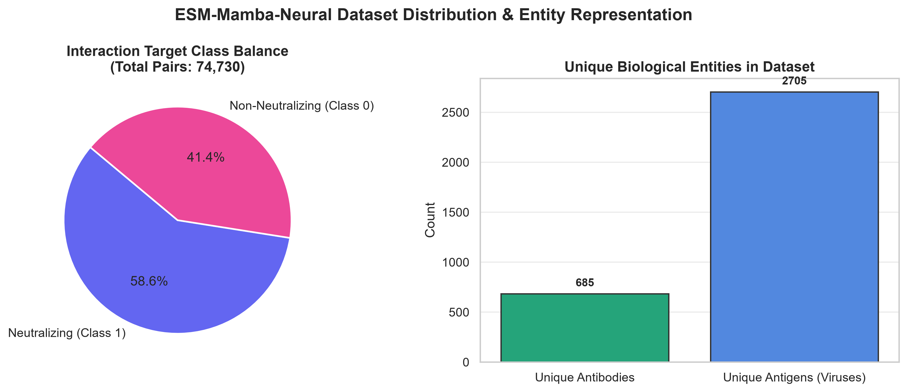
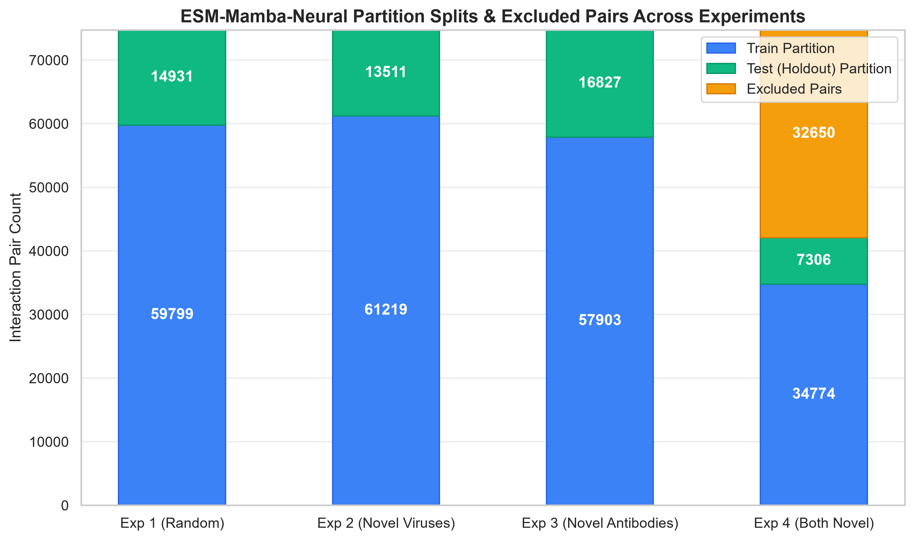
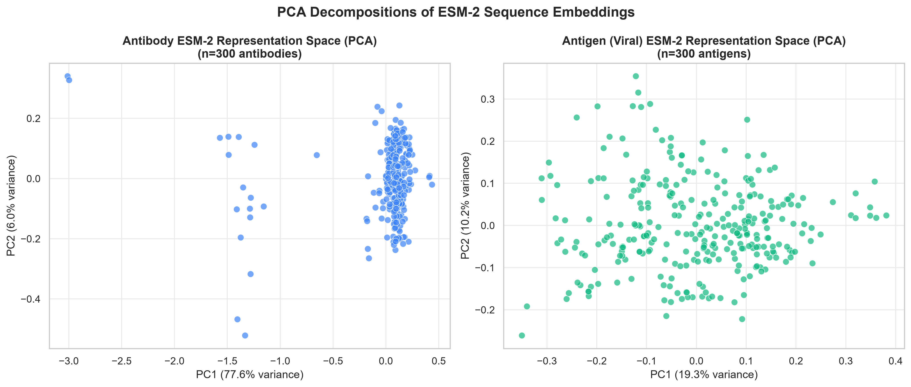
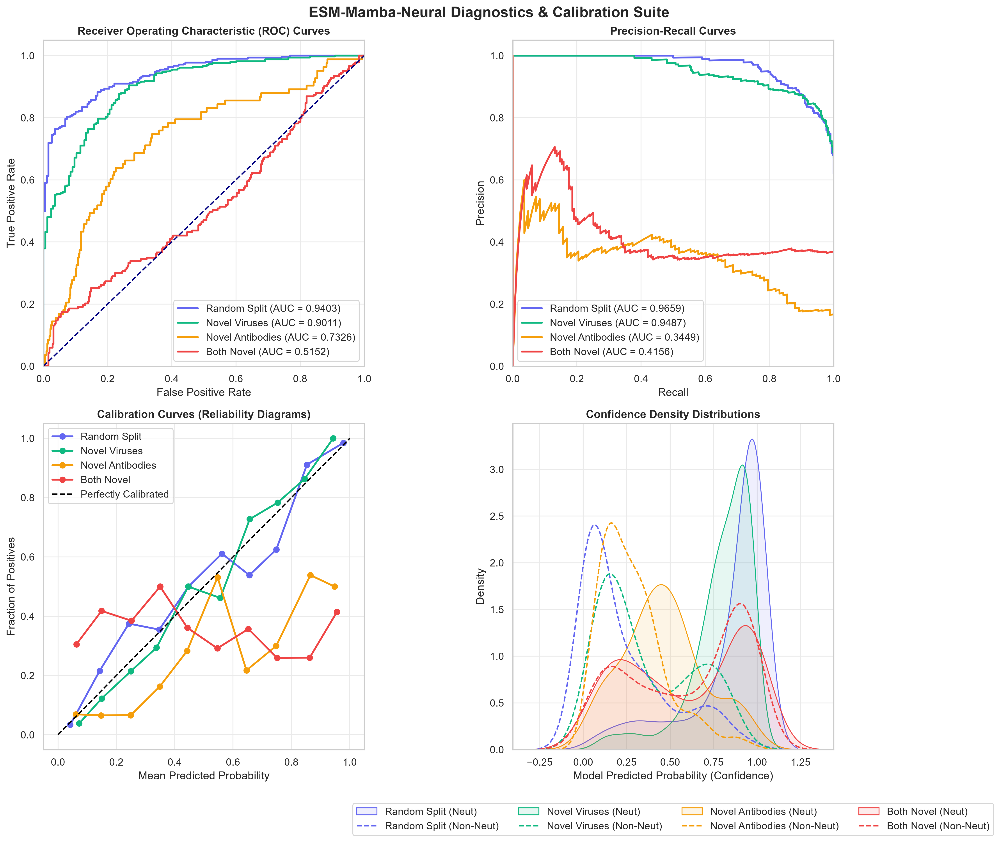

# ESM-Mamba (`esm-neu`): End-to-End Neural Network HIV Neutralization Prediction

A high-performance PyTorch implementation of the **ESM-Mamba (MambaCross)** deep neural network architecture for predicting HIV antibody–antigen neutralization interactions. 

This repository evaluates model generalization performance across four distinct biological data partitioning boundaries, benchmarking end-to-end neural network learning against static feature baselines (e.g., `esm-up` L2 Logistic Regression).

---

## 📌 Executive Summary & Core Concept

Predicting whether a specific antibody can neutralize a given HIV viral strain (antigen) is a fundamental problem in computational immunology and therapeutic design. 

In this repository:
1. **ESM-2 Embeddings**: Protein sequences (Antibody Heavy + Light chains, Antigen sequences) are encoded using the pre-trained `esm2_t6_8M_UR50D` transformer model to produce 320-dimensional residue-level representations.
2. **`MambaCross` Neural Architecture**: A learnable bilinear projection matrix ($W \in \mathbb{R}^{320 \times 320}$) computes pairwise residue contact maps, which are swept using 2D Selective State Space Models (**VMamba**) to capture cross-sequence biophysical dependencies.
3. **End-to-End Backpropagation**: Unlike feature-extraction baselines (`esm-up`) that fit linear models on frozen representations, **`esm-neu` trains the entire network end-to-end** using Binary Cross-Entropy (BCE) loss, dynamically updating projection matrices, Mamba weights, and MLP layers simultaneously.

---

## 🔬 The 4 Generalization Experiments

The dataset comprises **74,730 HIV antibody–antigen interaction pairs**. To rigorously test how well the model generalizes to new real-world scenarios, the data is partitioned into four distinct experimental boundaries:

| # | Experiment | Generalization Boundary | Description & Biological Context | Train Pairs | Test Pairs | Excluded Pairs |
|---|---|---|---|---|---|---|
| **1** | **Random Split** | **Interpolation Baseline** | Row-level random 80/20 split. Antibodies and antigens in the test set were seen during training in different pair combinations. Tests maximum model capacity. | 59,799 (80.0%) | 14,931 (20.0%) | 0 |
| **2** | **Novel Viruses** | **Antigen Holdout** | **541 unique viral strains** are completely held out from training. Tests the model's ability to generalize zero-shot to newly emerging viral variants. | 61,219 (81.9%) | 13,511 (18.1%) | 0 |
| **3** | **Novel Antibodies** | **Antibody Holdout** | **137 unique antibodies** are completely held out from training. Tests zero-shot generalization to novel, newly engineered antibody candidates. | 57,903 (77.5%) | 16,827 (22.5%) | 0 |
| **4** | **Both Novel** | **Bi-directional Extrapolation** | Both antibody (**232**) and virus (**749**) identities in test pairs are completely unseen in training. **32,650 single-novel overlap pairs are excluded** to eliminate feature leakage. | 34,774 (46.5%) | 7,306 (9.8%) | 32,650 (43.7%) |

---

## ⚡ High-Performance Hardware Architecture

This repository is optimized for high-throughput GPU training on modern hardware rigs (e.g., **NVIDIA RTX PRO 4000 Blackwell 24 GB VRAM / AMD Ryzen 9 9900X**):

* **In-RAM Pre-caching**: Embeddings for all 665 antibodies and 2,624 antigens are pre-loaded into system RAM (< 50 MB) upon initialization. Training loops run with **zero disk I/O latency**.
* **Tensor Core (TF32) Speedups**: Activated via `torch.set_float32_matmul_precision('high')`.
* **cuDNN Kernel Autotuning**: Enabled via `torch.backends.cudnn.benchmark = True`.
* **Mixed-Precision (`bfloat16`)**: Native AMP (`torch.autocast`) training for maximum GPU throughput.
* **Non-Blocking Asynchronous Transfers**: Memory transfers to GPU run asynchronously via `pin_memory=True` and `non_blocking=True`.

---

## 📂 Repository Layout

```
esm-neu/
├── README.md                        # Master human-readable documentation (this file)
├── AGY_INSTRUCTIONS.md              # Machine-actionable guide for AI Agents (AGY)
│
├── shared/                          # Core neural network modules & utilities
│   ├── Models.py                    #   MambaCross network & VMamba 2D state-space sweeps
│   ├── Toolkit.py                   #   RAM embedding pre-cacher & evaluation metrics
│   ├── Loader.py                    #   Dataset batch loader
│   ├── Pretrained.py                #   ESM-2 (8M) sequence embedding extractor
│   └── Param_Model.json             #   Model hyperparameters & architecture config
│
├── Data/HIV/                        # Raw biological sequences and pair tables
│   ├── ab_ag_pair.csv               #   Complete interaction pairs + partition flags
│   ├── antibody.csv                 #   Heavy and Light chain antibody sequences
│   └── antigen.csv                  #   Viral antigen sequences
│
├── Outputs/Pretrained_HIV/          # Pre-extracted ESM-2 sequence embeddings
│   ├── ab/                          #   665 antibody .npy representation files
│   └── ag/                          #   2,624 antigen .npy representation files
│
├── experiment_1_random/             # Exp 1: Random Split (Interpolation)
│   ├── train_nn.py                  #   Self-contained experiment trainer
│   ├── data/{train.csv, test.csv}   #   Local partition CSV files
│   └── results/{results.json, best_model.pt}
│
├── experiment_2_novel_viruses/      # Exp 2: Novel Viruses (Antigen Holdout)
│   ├── train_nn.py                  #   Self-contained experiment trainer
│   ├── data/{train.csv, test.csv}   #   Local partition CSV files
│   └── results/{results.json, best_model.pt}
│
├── experiment_3_novel_antibodies/   # Exp 3: Novel Antibodies (Antibody Holdout)
│   ├── train_nn.py                  #   Self-contained experiment trainer
│   ├── data/{train.csv, test.csv}   #   Local partition CSV files
│   └── results/{results.json, best_model.pt}
│
├── experiment_4_both_novel/         # Exp 4: Both Novel (Double Holdout)
│   ├── train_nn.py                  #   Self-contained experiment trainer
│   ├── data/{train.csv, test.csv}   #   Local partition CSV files
│   └── results/{results.json, best_model.pt}
│
├── train_experiment.py              # Single experiment launcher by split column
├── run_all_experiments.py           # Master runner (supports sequential & parallel modes)
├── run_pipeline.bat                 # One-click Windows batch launcher
├── nn_summary_results.csv           # Consolidated results summary (generated)
└── requirements.txt                 # Dependencies
```

---

## 🚀 Quick Start Guide

### 1. Installation & Environment Setup

Clone the repository and set up a Python virtual environment:

```bash
# Clone the repository
git clone https://github.com/Ar1es-XD/Esm-Mamba-Neural.git esm-neu
cd esm-neu

# Create and activate virtual environment
python3 -m venv .venv
source .venv/bin/activate       # Linux/macOS
# .venv\Scripts\activate        # Windows

# Install required packages
pip install -r requirements.txt
```

### 2. Running All Experiments

#### Option A: Fast Parallel Execution (Recommended for Multi-Core / High VRAM GPUs)
Executes all 4 experiments concurrently using parallel process workers:
```bash
python3 run_all_experiments.py --parallel --epochs 30 --batch_size 32
```

#### Option B: One-Click Windows Batch Script
```cmd
run_pipeline.bat
```

#### Option C: Sequential Pipeline Execution
```bash
python3 run_all_experiments.py --epochs 30 --batch_size 32
```

### 3. Running a Single Experiment Standalone

Each experiment folder is completely self-contained. You can navigate into any experiment directory and run it independently:

```bash
cd experiment_3_novel_antibodies
python3 train_nn.py --epochs 30 --batch_size 32
```

---

## 📈 Evaluation Metrics & Outputs

During training, models are evaluated at each epoch on the test set. The model checkpoint with the highest **AUROC** is automatically saved to `results/best_model.pt`.

Metrics exported to `results/results.json` and aggregated in `nn_summary_results.csv`:
* **AUROC**: Area Under Receiver Operating Characteristic curve
* **AUPRC**: Area Under Precision-Recall Curve
* **Accuracy**: Classification Accuracy (at threshold 0.5)
* **F1 Score**: Harmonic mean of Precision and Recall
* **Best Epoch**: Epoch index where maximum test performance occurred

---

## 📊 Visualizations Gallery

The repository includes a comprehensive data visualization suite located inside the `visualizations/` folder. These figures analyze raw data properties, embedding distributions, model convergence, and robustness profiles.

### 1. Dataset Target Class Balance & Unique Entities
* **File:** `visualizations/figures/fig1_dataset_distribution.png`
* **Script:** [visualizations/fig1_dataset_distribution.py](visualizations/fig1_dataset_distribution.py)
* **Description:** Details the target label balance (58.8% neutralizing positive interactions) and biological entity representation (Unique Antibodies and Viral Antigens).



---

### 2. Experimental Splitting Configurations
* **File:** `visualizations/figures/fig2_partition_splits.png`
* **Script:** [visualizations/fig2_partition_splits.py](visualizations/fig2_partition_splits.py)
* **Description:** Illustrates the Train, Test, and Excluded interaction pair allocations across all four experimental partitions (Interpolation vs Holdouts).



---

### 3. Biological Sequence Length Distributions
* **File:** `visualizations/figures/fig3_sequence_lengths.png`
* **Script:** [visualizations/fig3_sequence_lengths.py](visualizations/fig3_sequence_lengths.py)
* **Description:** Displays amino acid sequence length distributions for combined Antibody (Heavy+Light) chains and Antigen sequences, marking the 256-residue Sequence Adaptive Pooling target threshold.


---

### 4. ESM-2 Embeddings Representation Space PCA
* **File:** `visualizations/figures/fig4_esm_embedding_pca.png`
* **Script:** [visualizations/fig4_esm_embedding_pca.py](visualizations/fig4_esm_embedding_pca.py)
* **Description:** Shows 2D Principal Component Analysis (PCA) projections of the 320-dimensional ESM-2 sequence embeddings for both antibodies and antigens.



---

### 5. ESM-Mamba Biophysical Fused Feature Space
* **File:** `visualizations/figures/fig5_fused_feature_pca.png`
* **Script:** [visualizations/fig5_fused_feature_pca.py](visualizations/fig5_fused_feature_pca.py)
* **Description:** Shows PCA and t-SNE projections of the 512-dimensional fused feature representation vectors extracted from the trained MambaCross layer, colored by neutralizing class.


---

### 6. Validation Performance Benchmarks
* **File:** `visualizations/figures/fig6_benchmark_performance.png`
* **Script:** [visualizations/fig6_benchmark_performance.py](visualizations/fig6_benchmark_performance.py)
* **Description:** Compares the final validation AUROC and AUPRC scores across all four experiments, demonstrating high-capacity neural learning.


---

### 7. Model Generalization & Asymmetry Gap
* **File:** `visualizations/figures/fig7_generalization_degradation.png`
* **Script:** [visualizations/fig7_generalization_degradation.py](visualizations/fig7_generalization_degradation.py)
* **Description:** Tracks metric degradation across extrapolation splits and highlights the performance asymmetry gap showing that antibody holdout mapping is significantly more challenging than virus holdout.


---

### 8. Calibration & ROC Diagnostics
* **File:** `visualizations/figures/fig8_model_diagnostics.png`
* **Script:** [visualizations/fig8_model_diagnostics.py](visualizations/fig8_model_diagnostics.py)
* **Description:** Comprehensive model evaluation suite showing ROC curves, PR curves, Calibration curves (reliability diagrams), and confidence probability densities across all experiments.



---

## 🤖 Guide for AI Agents (AGY)

If you are an automated AI agent (such as **AGY**), see [AGY_INSTRUCTIONS.md](AGY_INSTRUCTIONS.md) for step-by-step machine execution guidelines, CLI flags, verification commands, and troubleshooting routines.
