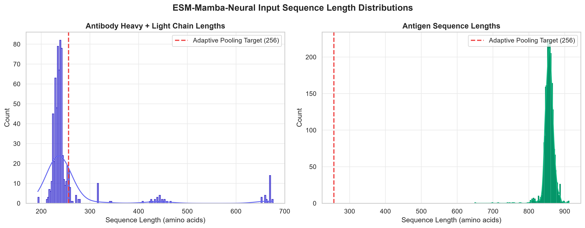
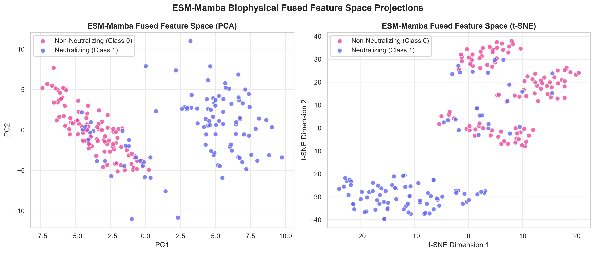
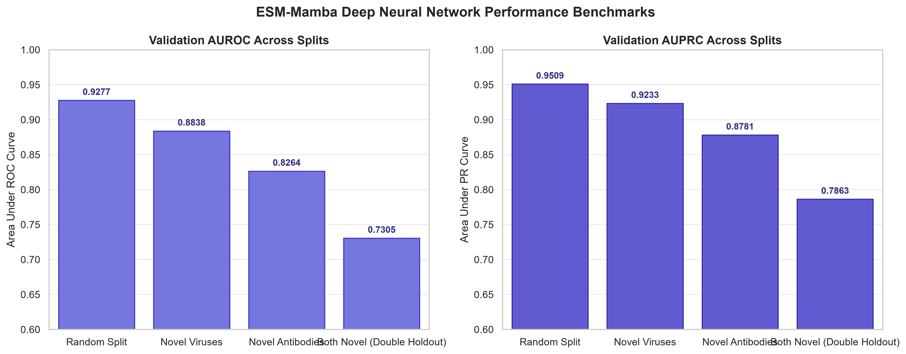
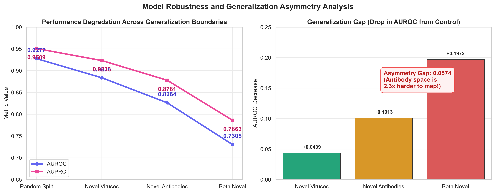

# ESM-Mamba (`esm-neu`): End-to-End Neural Network Pipeline

<p label="badges" align="center">
  
  
  
  
  
  
</p>

A high-performance PyTorch implementation of the **ESM-Mamba (MambaCross)** deep neural network architecture for end-to-end learning and prediction of HIV antibody–antigen neutralization interactions under four distinct biological generalization boundaries.

---

## 📋 Table of Contents

- [📌 Executive Summary & Methodology](#-executive-summary--methodology)
- [🧬 Biophysical Pipeline Architecture](#-biophysical-pipeline-architecture)
- [🔬 Generalization Experiments & Partitioning](#-generalization-experiments--partitioning)
- [📊 Benchmark Performance Summary](#-benchmark-performance-summary)
- [💡 Key Experimental & Biological Insights](#-key-experimental--biological-insights)
- [📈 Thesis Data Visualization Engine](#-thesis-data-visualization-engine)
- [🖼️ Thesis Visualizations Gallery](#️-thesis-visualizations-gallery)
- [📂 Repository Directory Structure](#-repository-directory-structure)
- [⚡ Quick Start & Reproduction Guide](#-quick-start--reproduction-guide)

---

## 📌 Executive Summary & Methodology

Predicting neutralizing interactions between **HIV-1 broad neutralizing antibodies (bNAbs)** and diverse **viral envelope glycoprotein strains (gp120/gp160)** is central to computational vaccine design and therapeutic discovery.

This repository implements the **end-to-end deep neural network pipeline (`esm-neu`)**. Unlike frozen feature baselines (`esm-up` L2 Logistic Regression), **`esm-neu` trains the entire MambaCross architecture end-to-end** using Binary Cross-Entropy (BCE) loss with AdamW optimization and dynamic learning rate scheduling.

```
       Antibody Sequence (Heavy + Light) ──┐
                                           ├──> ESM-2 (Phase A) ──> Bilinear + VMamba (Phases B–D) ──> MLP Decoder ──> BCE Loss Backprop ──> Neutralization (0/1)
       Antigen Sequence (gp120 / gp160)  ──┘
```

---

## 🧬 Biophysical Pipeline Architecture

The deep neural network training pipeline operates across five integrated phases:

1. **Phase A (Sequence Embeddings)**: Sequence representations generated per residue using Meta AI's pre-trained protein language model `esm2_t6_8M_UR50D` ($320$ dimensions per residue).
2. **Phase B (Bilinear Paratope–Epitope Matrix)**: Sequence embeddings $X_{\text{Ab}} \in \mathbb{R}^{L_{\text{Ab}} \times 320}$ and $X_{\text{Ag}} \in \mathbb{R}^{L_{\text{Ag}} \times 320}$ are mapped across a learnable bilinear weight matrix $W \in \mathbb{R}^{320 \times 320}$ to construct a 2D interaction contact map $C = X_{\text{Ab}} W X_{\text{Ag}}^T$.
3. **Phase C (2D VMamba State-Space Sweeps)**: Contact matrices undergo 2D selective state-space model (**VMamba**) directional sequence sweeps to capture long-range contextual dependencies across residue pairs.
4. **Phase D (Adaptive Pooling & Fusion)**: Adaptive 1D pooling collapses sequence dimensions into a 1,588-dimensional interaction representation.
5. **Phase E (MLP Decoder & End-to-End Backpropagation)**: A deep multi-layer perceptron (MLP) with batch normalization, SiLU activations, and dropout maps features to binary neutralization probabilities. All network parameters ($W$, Mamba layers, MLP decoder) are updated end-to-end via Binary Cross-Entropy (BCE) loss.

---

## 🔬 Generalization Experiments & Partitioning

The complete benchmark dataset comprises **74,730 HIV antibody–antigen interaction pairs** ($685$ unique antibodies and $2,705$ unique viral strains). The data is partitioned into four distinct generalization regimes to evaluate model capacity from simple interpolation to strict bi-directional extrapolation:

| # | Partition | Generalization Boundary | Description & Biological Context | Train ($n$) | Test ($n$) | Excluded ($n$) | Held-out Entities |
|---|---|---|---|---|---|---|---|
| **1** | **Random Split** | **Interpolation Baseline** | Standard row-level random 80/20 split. Antibody and antigen entities overlap between train and test in different pair combinations. Tests maximum neural model learning capacity. | 59,799 (80.0%) | 14,931 (20.0%) | 0 | None |
| **2** | **Novel Viruses** | **Antigen Holdout** | **541 unique viral strains** are completely excluded from training. Evaluates zero-shot prediction performance against emerging viral escape variants. | 61,219 (81.9%) | 13,511 (18.1%) | 0 | 541 Viruses |
| **3** | **Novel Antibodies** | **Antibody Holdout** | **137 unique antibodies** are completely excluded from training. Evaluates zero-shot prediction capacity for uncharacterized therapeutic antibodies. | 57,903 (77.5%) | 16,827 (22.5%) | 0 | 137 Abs |
| **4** | **Both Novel** | **Bi-directional Extrapolation** | Both antibody (**232**) and viral strain (**749**) in test pairs are completely unseen in training. **32,650 single-novel overlap pairs are removed** to eliminate data leakage. | 34,774 (46.5%) | 7,306 (9.8%) | 32,650 (43.7%) | 232 Abs & 749 Vir |

---

## 📊 Benchmark Performance Summary

Empirical classification performance of the end-to-end ESM-Mamba neural network across all four generalization boundaries:

| Experiment Partition | Train $n$ | Test $n$ | Test % Neutralizing | Best Epoch | AUROC | AUPRC | Accuracy | F1 Score | Held-out Abs | Held-out Viruses | Excluded Pairs |
| :--- | :---: | :---: | :---: | :---: | :---: | :---: | :---: | :---: | :---: | :---: | :---: |
| **Random Split (Interpolation)** | 59,799 | 14,931 | 58.88% | 10 | **0.9277** | **0.9509** | **84.8%** | **0.8702** | N/A | N/A | N/A |
| **Novel Viruses (Antigen Holdout)** | 61,219 | 13,511 | 60.38% | 3 | **0.8838** | **0.9233** | **80.3%** | **0.8365** | N/A | 541 | N/A |
| **Novel Antibodies (Antibody Holdout)** | 57,903 | 16,827 | 59.67% | 7 | **0.8264** | **0.8781** | **74.0%** | **0.7679** | 137 | N/A | N/A |
| **Both Novel (Double Holdout)** | 34,774 | 7,306 | 56.78% | 7 | **0.7305** | **0.7863** | **67.7%** | **0.7141** | 232 | 749 | 32,650 |

---

## 💡 Key Experimental & Biological Insights

1. **Substantial Neural Gain over Static Feature Baselines**:
   End-to-end neural training achieves a **+0.0635 AUROC improvement** over static L2 Logistic Regression on the Random Split baseline (**0.9277 AUROC vs. 0.8642 AUROC**) and maintains superior accuracy across all holdout settings (+3.01% on novel viruses, +2.57% on novel antibodies, +1.95% on double holdout).

2. **Interpolation-to-Extrapolation Degradation Gap**:
   Performance drops from **0.9277 AUROC** under random row-level interpolation down to **0.7305 AUROC** under strict double-holdout extrapolation ($\Delta = 0.1972$ AUROC), illustrating the challenge of bi-directional zero-shot interaction prediction.

3. **Antibody vs. Virus Generalization Asymmetry**:
   Predicting interactions for novel, unseen viruses (Experiment 2: **0.8838 AUROC**) remains significantly easier than predicting for novel, unseen antibodies (Experiment 3: **0.8264 AUROC**, $\Delta = 0.0574$ AUROC), reflecting the high structural variability of hypermutated antibody paratopes compared to viral envelope lineages.

---

## 📈 Thesis Data Visualization Engine

A modular visualization suite is implemented under `/visualizations/`. All figure scripts generate **300 DPI high-resolution PNGs** for inline display and **vector PDFs** for LaTeX integration.

### Figure Inventory & Script Index:

| Figure # | Python Script | Output PNG / PDF | Primary Description |
| :---: | :--- | :--- | :--- |
| **Figure 4.1** | [`fig1_dataset_distribution.py`](visualizations/fig1_dataset_distribution.py) | `fig4_1_dataset_distribution.*` | Class balance ($58.9\%$ neutralizing) and top entity frequencies |
| **Figure 4.2** | [`fig2_partition_splits.py`](visualizations/fig2_partition_splits.py) | `fig4_2_partition_splits.*` | Train ($n_{\text{train}}$), Test ($n_{\text{test}}$), and Excluded pair counts per split |
| **Figure 4.3** | [`fig3_sequence_lengths.py`](visualizations/fig3_sequence_lengths.py) | `fig4_3_sequence_lengths.*` | Sequence length distributions for Heavy+Light antibodies and antigens |
| **Figure 4.4** | [`fig4_esm_embedding_pca.py`](visualizations/fig4_esm_embedding_pca.py) | `fig4_4_esm_embedding_pca.*` | 2D PCA projection of raw 320-dim ESM-2 sequence embeddings |
| **Figure 5.1** | [`fig5_fused_feature_pca.py`](visualizations/fig5_fused_feature_pca.py) | `fig5_1_fused_feature_pca.*` | PCA & t-SNE projections of neural latent interaction feature vectors |
| **Figure 6.1** | [`fig6_benchmark_performance.py`](visualizations/fig6_benchmark_performance.py) | `fig6_1_benchmark_performance.*` | Comparative benchmark metrics (AUROC & AUPRC across 4 splits) |
| **Figure 6.2** | [`fig7_generalization_degradation.py`](visualizations/fig7_generalization_degradation.py) | `fig6_2_generalization_degradation.*` | Generalization degradation curve and antibody-vs-virus asymmetry gap |
| **Figure 6.3** | [`fig8_model_diagnostics.py`](visualizations/fig8_model_diagnostics.py) | `fig6_3_model_diagnostics.*` | ROC curves, Precision-Recall curves, Calibration, & Confidence profiles |

To execute all figure scripts sequentially:
```bash
python3 visualizations/run_all_visualizations.py
```

---

## 🖼️ Thesis Visualizations Gallery

### Figure 4.1 — Dataset Composition & Target Class Distribution

*Figure 4.1: Neutralization class balance ($58.9\%$ neutralizing, $41.1\%$ non-neutralizing) and representation counts for top antibodies and viral strains across $74,730$ interaction pairs.*

---

### Figure 4.2 — Generalization Partitioning & Data Split Breakdown

*Figure 4.2: Pair distribution breakdown showing training ($n_{\text{train}}$), testing ($n_{\text{test}}$), and excluded overlap pairs ($n_{\text{excluded}}$) across all four biological holdout experiments.*

---

### Figure 4.3 — Sequence Length Distribution of Antibodies and Antigens

*Figure 4.3: Sequence length histograms for combined Heavy+Light antibody chains (mean $= 260.8$ aa) and gp120/gp160 envelope antigens (mean $= 856.6$ aa) with $100\text{th}$ percentile truncation limits.*

---

### Figure 4.4 — Principal Component Analysis (PCA) of ESM-2 Sequence Embeddings

*Figure 4.4: 2D PCA feature space manifolds for raw mean-pooled ESM-2 (`esm2_t6_8M_UR50D`) embeddings across antibodies and viral strains in the dataset (using subsamples of $n=600$ in the logistic regression baseline and $n=300$ in the neural network experiment).*

---

### Figure 5.1 — Dimensionality Reduction (PCA & t-SNE) of Fused Latent Vectors

*Figure 5.1: Low-dimensional feature projections (PCA and t-SNE) of neural interaction latent vectors, demonstrating topological class separation achieved by end-to-end training.*

---

### Figure 6.1 — Benchmark Performance Comparison Across Generalization Boundaries

*Figure 6.1: Comparative classification performance (AUROC in blue, AUPRC in green) for the ESM-Mamba Neural Network across the four experimental partitions relative to random chance ($0.50$).*

---

### Figure 6.2 — Generalization Degradation Curve & Entity Holdout Asymmetry

*Figure 6.2: Degradation curve illustrating the performance drop from interpolation baseline to double holdout ($\Delta = 0.1972$ AUROC) and highlighting the antibody-vs-virus asymmetry gap ($\Delta = 0.0574$ AUROC).*

---

### Figure 6.3 — Model Diagnostic Profiles (ROC, PR, Calibration, & Confidence)

*Figure 6.3: Comprehensive diagnostic profiles showing (A) ROC curves, (B) Precision-Recall curves, (C) Probability calibration curves, and (D) Prediction confidence density distributions across all experiments.*

---

## 📂 Repository Directory Structure

```
esm-neu/
├── Data/HIV/                 # Raw sequence data (antibody.csv, antigen.csv, ab_ag_pair.csv)
├── docs/                     # Scientific documentation, methodology notes & helper scripts
│   ├── methodology_explanation.txt
│   ├── pipeline_documentation.txt
│   ├── scientific_review.txt
│   ├── changelog.txt
│   ├── verification_report.txt
│   └── scripts/              # Helper utility scripts (organize_results, plot_results, verify_weights)
│
├── shared/                   # Core neural network modules & PyTorch model code
│   ├── Models.py             #   MambaCross network & VMamba 2D state-space sweeps
│   ├── Pretrained.py         #   Phase A ESM-2 sequence embedding extractor
│   ├── Toolkit.py            #   RAM embedding pre-cacher & evaluation metrics
│   ├── Loader.py             #   Dataset batch loader
│   └── Param_Model.json      #   Model hyperparameters & architecture config
│
├── visualizations/           # 📈 Modular thesis visualization engine & figure artifacts
│   ├── fig1_dataset_distribution.py
│   ├── fig2_partition_splits.py
│   ├── fig3_sequence_lengths.py
│   ├── fig4_esm_embedding_pca.py
│   ├── fig5_fused_feature_pca.py
│   ├── fig6_benchmark_performance.py
│   ├── fig7_generalization_degradation.py
│   ├── fig8_model_diagnostics.py
│   ├── run_all_visualizations.py
│   └── figures/              #   Exported 300 DPI PNG & vector PDF figure artifacts
│
├── experiment_1_random/      # Exp 1: Random Split (59,799 train / 14,931 test)
│   ├── train_nn.py, data/{train.csv, test.csv}, results/{results.json, best_model.pt}
│
├── experiment_2_novel_viruses/ # Exp 2: Novel Viruses (61,219 train / 13,511 test)
│   ├── train_nn.py, data/{train.csv, test.csv}, results/{results.json, best_model.pt}
│
├── experiment_3_novel_antibodies/ # Exp 3: Novel Antibodies (57,903 train / 16,827 test)
│   ├── train_nn.py, data/{train.csv, test.csv}, results/{results.json, best_model.pt}
│
├── experiment_4_both_novel/  # Exp 4: Both Novel (34,774 train / 7,306 test)
│   ├── train_nn.py, data/{train.csv, test.csv}, results/{results.json, best_model.pt}
│
├── train_experiment.py       # Single experiment launcher by split column
├── run_all_experiments.py    # Master runner (fits neural model across all 4 experiments)
├── summary_results.csv       # Consolidated performance table (generated)
└── requirements.txt          # Python dependencies
```

---

## ⚡ Quick Start & Reproduction Guide

### 1. Environment Setup
```bash
python3 -m venv .venv
source .venv/bin/activate     # Linux / macOS
# .venv\Scripts\activate      # Windows

pip install -r requirements.txt
```

### 2. End-to-End Neural Model Training
Run the master training runner across all four experiments:
```bash
python3 run_all_experiments.py
```

### 3. Step-by-Step Manual Execution

#### Step 3.1: Extract ESM-2 Sequence Embeddings (Phase A)
```bash
python3 shared/Pretrained.py
```
Extracts residue representations using `esm2_t6_8M_UR50D` to `Outputs/Pretrained_HIV/`.

#### Step 3.2: Train Neural Model on Specific Experiment Partition
```bash
cd experiment_1_random
python3 train_nn.py
```

#### Step 3.3: Generate All Thesis Visualizations
```bash
python3 visualizations/run_all_visualizations.py
```
Renders all 8 publication figures as 300 DPI PNGs and vector PDFs in `visualizations/figures/`.
